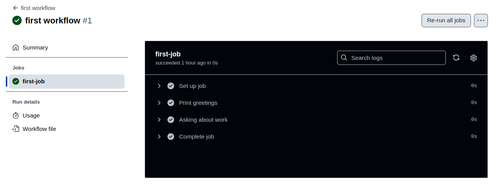
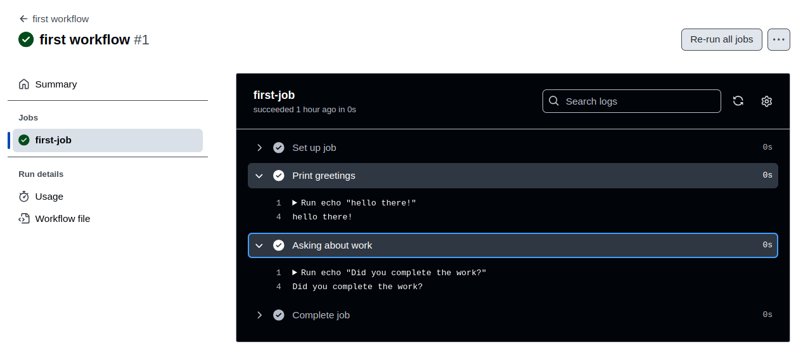

# Git_Action

+ A Git Action is a custom application for the GitHub Actions platform that performs a complex but frequently repeated task. It helps reduce the amount of repetitive code written in workflow files by encapsulating a specific task or set of tasks into a reusable unit.

+ In DevOps that enables developers to automate software development workflows directly within their GitHub repository. By integrating with existing tools and services, Git Actions streamlines the development lifecycle, improving efficiency, reliability, and collaboration


+ Basic workflow of git_action

```yml
name: first workflow
on: workflow_dispatch
jobs: 
   first-job:
       runs-on: ubuntu-latest
       steps:
          - name: Print greetings
            run: echo "hello there!"
          - name: Asking about work
            run: echo "Did you complete the work?"
```

## Output



<br>
<br>



<br>

---


+ ### Component of basic workflow

    + **name:** This specifies the name of the workflow.
    
    + **on workflow_dispatch:** This indicates that the workflow can be triggered manually by a user. It won't run automatically on code pushes or other events.
    
    + **jobs:** This section defines the jobs that will run as part of the workflow.
    
    + **job-name:** This is component after jobs it specify the name of the job.
    
    + **runs-on:** This specifies the environment in which the job will run.
    
    + **steps:** This section contains the steps that the job will execute.
    
    + **name:**  This step is label
    
    + **run:** it will run the process defined in this step


### Just For Knowledge

### Running Multi-Line Shell Commands


+ If you need to run multiple shell commands (or multi-line commands, e.g., for readability), you can easily do so by adding the pipe symbol (|) as a value after the run: key.

+ Like this:

```yml
...
run: |
    echo "First output"
    echo "Second output"
```    

- This will run both commands in one step.


